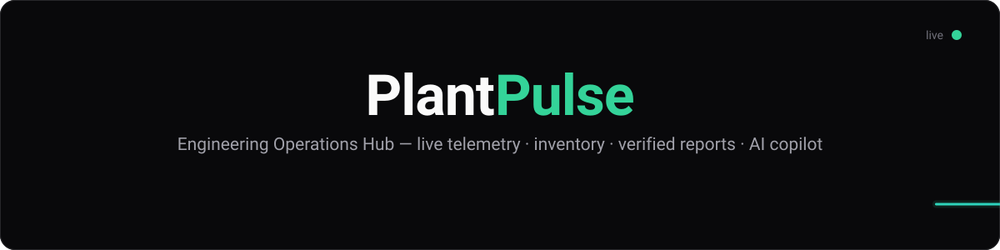
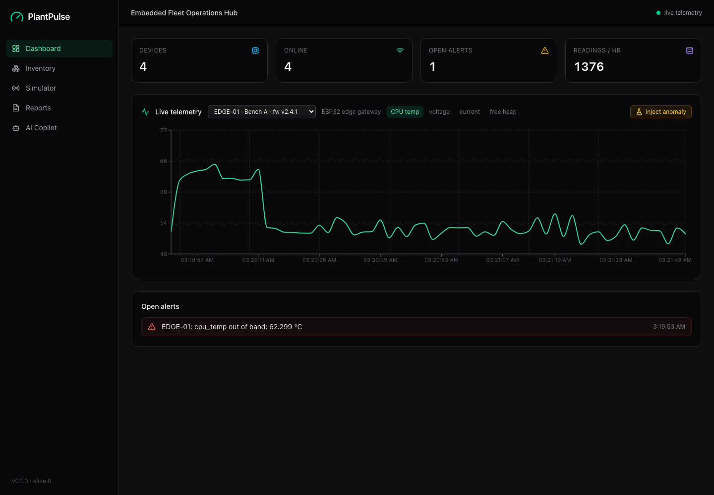
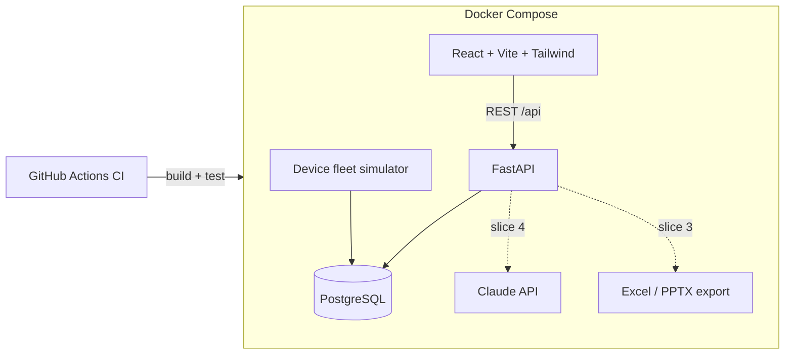

<p align="center">
  
</p>

<p align="center">
  <a href="https://github.com/dennisriverab28/PlantPulse/actions/workflows/ci.yml"></a>
  
  
  
  
  
  
  
</p>

<p align="center">
  An embedded device fleet's single pane of glass — live telemetry from test benches,
  firmware tracking, lab inventory, verified reporting, and an AI copilot.<br>
  Built end to end with industry-standard practices: containerized services, CI,
  typed code, and a tested simulation engine.
</p>

---

<p align="center">
  
</p>

## ✨ What it does

- 📡 **Live fleet dashboard** — embedded devices (edge gateways, HIL rigs, sensor
  nodes, vision modules) stream telemetry — SoC temperature, supply voltage,
  current draw, free heap — into PostgreSQL; the dashboard charts it in near real
  time with animated stat cards and surfaces out-of-band alerts.
- ⚙️ **Device fleet simulator** — realistic sinusoidal duty cycles + gaussian noise
  per device (not random static), with **one-click anomaly injection**: thermal
  runaway, sagging supply rail, heap leak — and watch the alert detector fire live.
- 🔌 **Firmware tracking** — every device carries its firmware version; OTA update
  tracking and validation campaigns build on this.
- 📦 **Lab inventory** *(slice 2)* — dev boards, sensors, debug probes, components;
  locations and low-stock alerts.
- 📊 **Reports** *(slice 3)* — one-click Excel workbooks and PowerPoint status decks,
  plus a **firmware-validation verifier** that cross-checks submitted test reports
  against recorded telemetry.
- 🤖 **AI copilot** *(slice 4)* — ask questions about fleet data in plain English;
  the copilot writes safe, read-only SQL and shows its work.

## 🏗 Architecture



## 🚀 Quickstart

**With Docker (recommended):**

```bash
docker compose up
# frontend  → http://localhost:5173
# API docs  → http://localhost:8000/docs
```

**Without Docker** (falls back to SQLite — zero setup):

```bash
# Terminal 1 — backend
cd backend
python3.12 -m venv .venv && source .venv/bin/activate
pip install -r requirements.txt -r requirements-dev.txt
uvicorn app.main:app --reload

# Terminal 2 — frontend
cd frontend
npm install
npm run dev
```

Then hit the **⚗ inject anomaly** button on the dashboard and watch the alert
fire within a few ticks.

## 🧪 Tests

```bash
cd backend && pytest
```

Covers the API surface and the simulation engine (normal readings stay in band,
injected anomalies trip the detector, anomalies clear after their window).

## 🗺 Roadmap

- [x] **Slice 0** — scaffold: FastAPI + device fleet simulator + React dashboard + Docker + CI
- [ ] **Slice 1** — Alembic migrations, simulator controls UI, manual + CSV test-log entry, WebSocket live updates
- [ ] **Slice 2** — auth (JWT, roles: admin / engineer / viewer), lab inventory tracker
- [ ] **Slice 3** — Excel/PPTX report generator + firmware-validation report verifier
- [ ] **Slice 4** — AI copilot (natural language → read-only SQL)
- [ ] **Slice 5** — polish, bench map fleet view, seed history, cloud deploy + auto-deploy from CI

## 🧰 Stack

| Layer    | Tech                                                            |
| -------- | --------------------------------------------------------------- |
| Frontend | React 19, TypeScript, Vite, Tailwind 4, Framer Motion, Recharts |
| Backend  | Python 3.12, FastAPI, SQLAlchemy 2, Pydantic v2                 |
| Data     | PostgreSQL 16 (SQLite fallback for zero-setup dev)              |
| Infra    | Docker Compose, GitHub Actions CI                               |

## 📄 License

[MIT](LICENSE) © Dennis Rivera
